# AgriSense IoT Monitor

<div align="center">


**Enterprise-grade monitoring platform for agricultural IoT sensors and telemetry systems**

[](LICENSE)
[](https://www.docker.com/)
[](https://kubernetes.io/)
[](https://prometheus.io/)
[](https://grafana.com/)

[Features](#features) • [Quick Start](#quick-start) • [Architecture](#architecture) • [Documentation](#documentation) • [Demo](#live-demo)

</div>

---

## Overview

AgriSense is a production-ready IoT monitoring solution designed for agricultural sensor networks. Built to demonstrate enterprise observability practices for systems like FeedAlert, it showcases real-time telemetry collection, intelligent alerting, and modern DevOps workflows for smart farming applications.

### Use Cases

- 🌾 **Silo Feed Monitoring** - Track feed levels with load cell sensors
- 📡 **Wireless Connectivity** - Monitor signal strength and device health
- 🔋 **Battery Management** - Proactive low battery alerts
- 🚨 **Intelligent Alerting** - Multi-severity notifications (Critical/Warning/Info)
- 📊 **Real-time Analytics** - Live dashboards for farm operations
- 🔧 **Technical Support** - Structured incident response workflows

---

## Features

### Core Capabilities

- **Real-time Telemetry Collection** - MQTT-based device communication with 15-second intervals
- **Time-Series Metrics** - Prometheus for efficient data storage and querying
- **Advanced Visualization** - Custom Grafana dashboards for agricultural metrics
- **Multi-Severity Alerting** - Intelligent routing (Critical → PagerDuty, Warnings → Slack)
- **Horizontal Scaling** - Kubernetes-native with HPA support
- **CI/CD Pipeline** - Automated testing and deployment via GitHub Actions
- **Data Validation** - Real-time sensor health checks and dropout detection
- **Incident Management** - Integrated workflow from alert to resolution

### Technical Highlights

- ☸️ **Kubernetes-Native** - Microservices architecture with service mesh
- 🔄 **GitOps Ready** - ArgoCD integration for declarative deployments
- 📈 **Production Observability** - Full monitoring stack (Prometheus, Grafana, AlertManager)
- 🔐 **Security First** - Secrets management, RBAC, network policies
- 🐳 **Containerized** - Docker Compose for development, K8s for production
- 🧪 **Well Tested** - Unit, integration, and E2E test coverage

---

## Architecture

### System Overview


### Alert Management Flow


### Technology Stack

| Component | Technology | Purpose |
|-----------|------------|---------|
| **Message Broker** | MQTT (Eclipse Mosquitto) | Device communication |
| **Metrics Collection** | Prometheus | Time-series metrics storage |
| **Visualization** | Grafana | Dashboards and analytics |
| **Alert Management** | AlertManager | Alert routing and grouping |
| **Container Orchestration** | Kubernetes + Docker | Microservices deployment |
| **API Gateway** | Node.js (Express) | RESTful API endpoints |
| **Device Simulator** | Python 3.11 | IoT device emulation |
| **Caching** | Redis | Fast data access |
| **CI/CD** | GitHub Actions + ArgoCD | Automated deployment |
| **Logging** | Loki | Log aggregation |
| **APM** | Datadog | Application performance |

---

## Quick Start

### Prerequisites

```bash
# Required
- Docker Engine 24.0+
- Docker Compose 2.24+
- 8 GB RAM minimum (16 GB recommended)
- 150 GB disk space

# Optional (for Kubernetes)
- kubectl
- minikube or k3s
```

### Installation

```bash
# Clone repository
git clone git@github.com:adeolu-rabiu/agrisense-iot-monitor.git
cd agrisense-iot-monitor

# Start all services
docker-compose up -d

# Verify deployment
docker-compose ps

# View logs
docker-compose logs -f
```

### Access Dashboards

| Service | URL | Default Credentials |
|---------|-----|---------------------|
| **Grafana** | http://localhost:3000 | admin / admin |
| **Prometheus** | http://localhost:9090 | N/A |
| **AlertManager** | http://localhost:9093 | N/A |
| **Device Simulator** | http://localhost:8081/metrics | N/A |

---

## Live Demo

### Sample Dashboards

**AgriSense Overview Dashboard**
- Total devices online: 24/24
- System uptime: 99.7%
- Active critical alerts: 1
- Average response time: 145ms

**Device Health Monitoring**
- Silo 1: 16,640 kg (92% capacity) - Healthy
- Silo 2: 12,425 kg (69% capacity) - Healthy  
- Silo 3: 8,234 kg (46% capacity) - Warning (Low signal)
- Silo 4: 15,890 kg (88% capacity) - Healthy
- Silo 5: 4,521 kg (25% capacity) - Critical (Low battery)

### Sample Alerts

```yaml
ALERT: CriticalBattery
  Labels:
    severity: critical
    silo_id: Silo_5
  Annotations:
    summary: Critical battery level on Silo_5
    description: Battery at 15% - immediate attention required
  Status: FIRING
  Duration: 15m

ALERT: LowSignalStrength  
  Labels:
    severity: warning
    silo_id: Silo_3
  Annotations:
    summary: Low signal strength detected
    description: RSSI: -95 dBm - connectivity degraded
  Status: FIRING
  Duration: 8m
```

---

## Documentation

### Complete Guide

- **[Getting Started](docs/GETTING-STARTED.md)** - Step-by-step setup guide
- **[Architecture Overview](docs/ARCHITECTURE.md)** - Detailed system design
- **[Deployment Guide](docs/DEPLOYMENT.md)** - Production deployment (ESXi, AWS, K8s)
- **[API Documentation](docs/API.md)** - REST API reference
- **[Alert Configuration](docs/ALERTS.md)** - Alert rules and routing
- **[Troubleshooting](docs/TROUBLESHOOTING.md)** - Common issues and solutions

### Architecture Diagrams

All diagrams are available in the [docs/diagrams](docs/diagrams/) directory:

1. [System Architecture](docs/diagrams/01-system-architecture.md) - Complete system overview
2. [Alert Management Flow](docs/diagrams/02-alert-management.md) - Alert lifecycle
3. [CI/CD Pipeline](docs/diagrams/03-cicd-pipeline.md) - Deployment workflow
4. [Data Flow Sequence](docs/diagrams/04-data-flow-sequence.md) - Telemetry processing
5. [Incident Response](docs/diagrams/05-incident-workflow.md) - Support workflows
6. [Kubernetes Architecture](docs/diagrams/06-kubernetes-architecture.md) - K8s deployment
7. [Customer Onboarding](docs/diagrams/07-customer-onboarding.md) - Project coordination

---

## Configuration

### Environment Variables

```bash
# docker-compose.yml
MQTT_BROKER_URL=mqtt://mqtt-broker:1883
PROMETHEUS_URL=http://prometheus:9090
GRAFANA_ADMIN_PASSWORD=your_secure_password
SLACK_WEBHOOK_URL=https://hooks.slack.com/services/YOUR/WEBHOOK/URL
ALERT_MANAGER_URL=http://alertmanager:9093
```

### Alert Rules

```yaml
# prometheus/alert_rules.yml
groups:
  - name: agrisense_device_alerts
    interval: 30s
    rules:
      - alert: SensorDropout
        expr: rate(sensor_dropout_total[5m]) > 0.1
        for: 2m
        labels:
          severity: critical
        annotations:
          summary: "Sensor dropout detected"
          description: "Silo {{ $labels.silo_id }} sensor failure rate: {{ $value }}"

      - alert: LowBattery
        expr: battery_level_percent < 20
        for: 10m
        labels:
          severity: warning
        annotations:
          summary: "Low battery level"
          description: "Silo {{ $labels.silo_id }} battery at {{ $value }}%"
```

---

## Performance Metrics

### Benchmarks

| Metric | Value | Notes |
|--------|-------|-------|
| **Devices Monitored** | 24 (5 silos simulated) | Scalable to 1000+ |
| **Data Collection Interval** | 15 seconds | Configurable |
| **Alert Latency** | < 30 seconds | From breach to notification |
| **Dashboard Load Time** | < 2 seconds | Grafana rendering |
| **Prometheus Query Time** | < 500ms | Simple metrics |
| **System CPU Usage (idle)** | 10-20% | 4 vCPU VM |
| **Memory Usage (steady state)** | 10-12 GB | 16 GB VM recommended |
| **Storage Growth** | ~2 GB/month | 30-day retention |

### Scalability

- **Horizontal Scaling**: Kubernetes HPA configured for 2-10 replicas
- **Vertical Scaling**: Tested on 2-8 vCPU configurations
- **Load Testing**: Successfully handles 1000 devices with 15s intervals
- **High Availability**: Multi-replica deployments with zero-downtime updates

---

## Deployment Options

### Docker Compose (Development)

```bash
docker-compose up -d
```

### Kubernetes (Production)

```bash
# Create namespace
kubectl create namespace agrisense-production

# Deploy with Helm
helm install agrisense ./helm/agrisense \
  --namespace agrisense-production \
  --values values-production.yaml

# Or with kubectl
kubectl apply -f kubernetes/
```

### ESXi Deployment

See [ESXi Deployment Guide](docs/DEPLOYMENT-ESXI.md) for VMware virtualization setup.

**Recommended VM Specs:**
- vCPUs: 4
- RAM: 16 GB
- Disk: 150 GB (SSD, Thin Provisioned)
- Network: VMXNET3

---

## CI/CD Pipeline

### Automated Workflow

```mermaid
flowchart LR
    DEV[Developer] --> COMMIT[Git Commit]
    COMMIT --> PUSH[Push to GitHub]
    PUSH --> GH[GitHub Actions]
    GH --> LINT[Lint & Test]
    LINT --> BUILD[Build Images]
    BUILD --> SCAN[Security Scan]
    SCAN --> STAGE[Deploy to Staging]
    STAGE --> APPROVE{Manual Approval}
    APPROVE -->|Yes| PROD[Deploy to Production]
    PROD --> VERIFY{Health Check}
    VERIFY -->|Pass| SUCCESS[✅ Success]
    VERIFY -->|Fail| ROLLBACK[🔄 Rollback]
```



### Deployment Statistics

- **Build Time**: ~3 minutes
- **Test Coverage**: 85%
- **Deployment Frequency**: On demand (main branch)
- **Mean Time to Recovery**: < 5 minutes (automated rollback)
- **Change Failure Rate**: < 5%

---

## Development

### Local Setup

```bash
# Install dependencies
npm install  # API Gateway
pip install -r requirements.txt  # Device Simulator

# Run in development mode
docker-compose -f docker-compose.dev.yml up

# Run tests
npm test
pytest tests/
```

### Project Structure

```
agrisense-iot-monitor/
├── api-gateway/           # Node.js API service
├── device-simulator/      # Python IoT simulator
├── prometheus/            # Metrics configuration
├── grafana/              # Dashboard definitions
├── alertmanager/         # Alert routing config
├── kubernetes/           # K8s manifests
├── helm/                 # Helm charts
├── .github/workflows/    # CI/CD pipelines
├── docs/                 # Documentation
├── tests/                # Test suites
└── docker-compose.yml    # Dev environment
```

---

## Monitoring & Observability

### Key Metrics Tracked

**Device Metrics:**
- `device_weight_kg` - Current silo weight
- `signal_strength_dbm` - Wireless signal quality
- `battery_level_percent` - Device battery status
- `sensor_dropout_total` - Sensor failure counter

**System Metrics:**
- `http_request_duration_seconds` - API response time
- `container_cpu_usage_percent` - Resource utilization
- `container_memory_usage_bytes` - Memory consumption
- `prometheus_tsdb_storage_blocks_bytes` - Storage usage

### Grafana Dashboards

1. **AgriSense Overview** - System health and KPIs
2. **Device Health Monitor** - Individual device status
3. **Alert History** - Alert trends and patterns
4. **System Performance** - Infrastructure metrics
5. **Customer Dashboard** - Farm-specific view

---

## Security

### Best Practices Implemented

- **Secrets Management**: Kubernetes Secrets, no hardcoded credentials
- **Network Policies**: Pod-to-pod communication restrictions
- **RBAC**: Role-based access control for K8s resources
- **TLS/SSL**: HTTPS for all external endpoints
- **Container Scanning**: Trivy security scans in CI pipeline
- **Least Privilege**: Non-root containers, minimal permissions

---

## Contributing

This is a portfolio/demonstration project. However, feedback and suggestions are welcome!

### Reporting Issues

Please open an issue with:
- Description of the problem
- Steps to reproduce
- Expected vs actual behavior
- Environment details (OS, Docker version, etc.)

---

## Roadmap

### Planned Features

- [ ] Multi-tenancy support for multiple farms
- [ ] Mobile app for iOS/Android
- [ ] Predictive analytics using ML
- [ ] LoRaWAN device support
- [ ] Integration with weather APIs
- [ ] Automated firmware OTA updates
- [ ] Advanced capacity forecasting
- [ ] Cost optimization analytics

---

## License

MIT License - See [LICENSE](LICENSE) file for details.

---

## Author

**Adeolu Rabiu**
- LinkedIn: [linkedin.com/in/adeolurabiu](https://linkedin.com/in/yourprofile)
- Email: adeolu.rabiu@gmail.com
- GitHub: [@adeolu-rabiu](https://github.com/adeolu-rabiu)

---

## Acknowledgments

This project was developed as a technical portfolio piece to demonstrate:
- Production-grade IoT monitoring architecture
- Enterprise observability practices
- Modern DevOps workflows
- Agricultural technology domain knowledge

Inspired by real-world AgriTech platforms and built to showcase skills relevant to technical support, system coordination, and IoT operations roles in the agricultural technology sector.

---

## Support

For questions or support:

- **Documentation**: Check the [docs/](docs/) directory
- **Issues**: Open a GitHub issue
- **Email**: adeolu.rabiu@gmail.com

---

<div align="center">

**Built with** ❤️ **for smart farming and agricultural innovation**

[⬆ Back to Top](#agrisense-iot-monitor)

</div>
